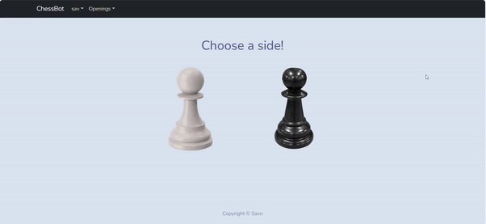

# Chess Openings App

A web application for browsing and saving chess openings for educational purposes. Visit https://chessfox.com/chess-openings-list/ for more in depth learning and information!.

## Features

- View chess openings and their move sequences.
- Save favorite openings for later reference.
- Navigate between different openings.
- No user authentication required.

## Technologies Used

- Frontend: React, React Router, Bootstrap
- Backend: Django, Django REST Framework
- Chess logic: Chess.js
- Web scraping: BeautifulSoup, requests

## Installation

1. Clone the repository:
   ```bash
   git clone [https://github.com/your-username/chess-openings-app](https://github.com/Savoyevatel/chess_webscrape).git
   cd chess_webscrape

## TO DO

* Add analytics according to players feedback.
* Add winrate.

## Demo

